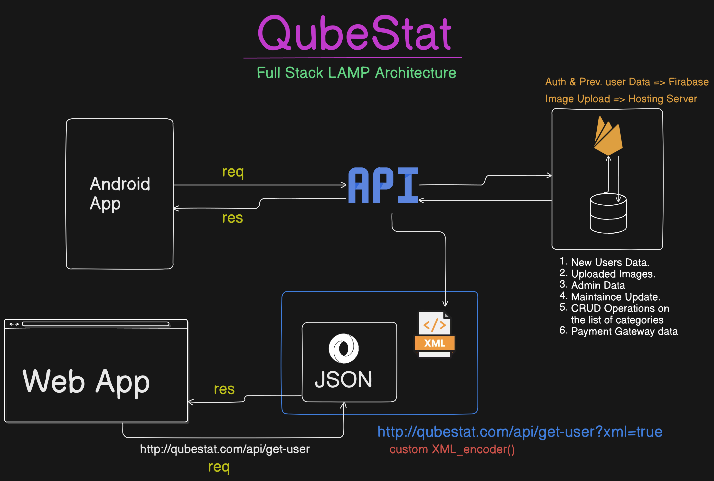

# QubeStat: Full Stack LAMP

## Setup Project:

- `cd backend` or `cd frontend` based on your developer role.

- For ***Backend Devs***: Read Instructtion from [`backend/README.md`]("https://github.com/Nil369/QubeStat/blob/main/backend/README.md)

- For ***Frontend Devs***: Read Instructtion from `frontend/README.md`

